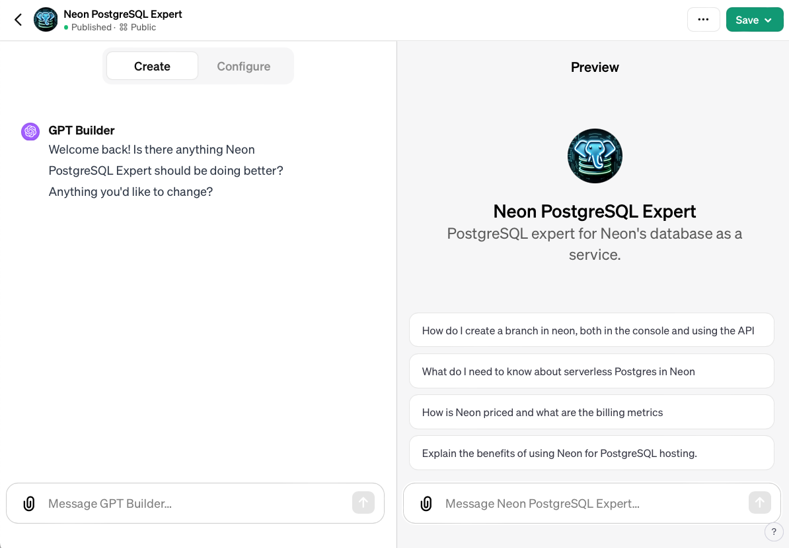

# neon-postgresql-expert-gpt

## What is this

OpenAI Chatgpt plus Neon PostgreSQL Expert

Hi all, for those of you who have a chatgpt plus subscription, I have created a GPT dedicated to answer  questions about Neon database and Postgres.
You can access the GPT here
[Neon PostgreSQL expert](https://chat.openai.com/g/g-Zb5CCMkXZ-neon-postgresql-expert)

Note that current state of the art for large language models (like OpenAI) is that they can invent responses just to be nice to you (hallucinations), so it is recommended to double check the answers in the official neon documentation.

I have also announced this in the neon community here https://community.neon.tech/t/neon-postgresql-expert-gpt/1405

The content currently added to the GPT (using RAG) is

- all markdown from public github repo https://github.com/neondatabase/website
- all markdown from public github repo https://github.com/neondatabase/neon
- the postgres documentation from https://www.postgresql.org
- some internal postgres documentation we collected

See the markdown folder for the aggregated markdown files.

To refresh the markdown files with new content:

- clone the neondatabase/neon repo
- clone the neondatabase/website repo
- clone this repo
- run the script `./createGptInputForNeonRepo.py`
- run the script `./createGptInputForWebsiteRepo.py`

Upload the files to the GPT (currently only the GPT creator can modify the GPT on chat.openai.com under his account).

## How can you create a gpt

For those of you interested how you can create a GPT.
- you need a chatgpt Plus subscription (I don't know of they re-opened the subscription process, for some time it was blocked due to huge demand)
- In the sidebar under "Explore" you can create a new GPT
- You can use the GPT wizard to come up with a name, icon and custom chatGPT prompt suggestion
- Important part: you can provide additional knowledge (text documents).
- The text document formats supported is limited (I used markdown and PDF)
- The text will be splitted into pieces, added to a vector DB and used for Retrieval Augmented Generation (RAG) - this is all automated by GPT UI in chatGPT Plus
- The number of documents you can configure is limited to around 20 at the moment. So the custom code I have written is two python scripts, one for each neon repo, to collect all markdown into a single markdown document (with a useful sequence and also useful chapter titles for the slugs from the sidebar.yaml)
- That's basically it - it is quite simple compared to using langchain or openAI APIs

## Current configuration on chatgpt

